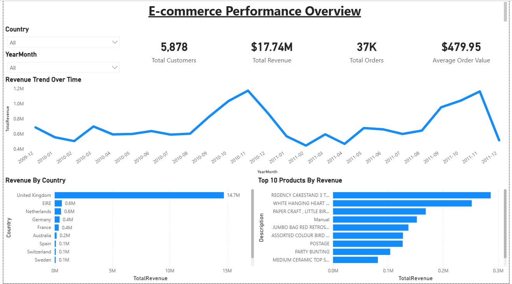
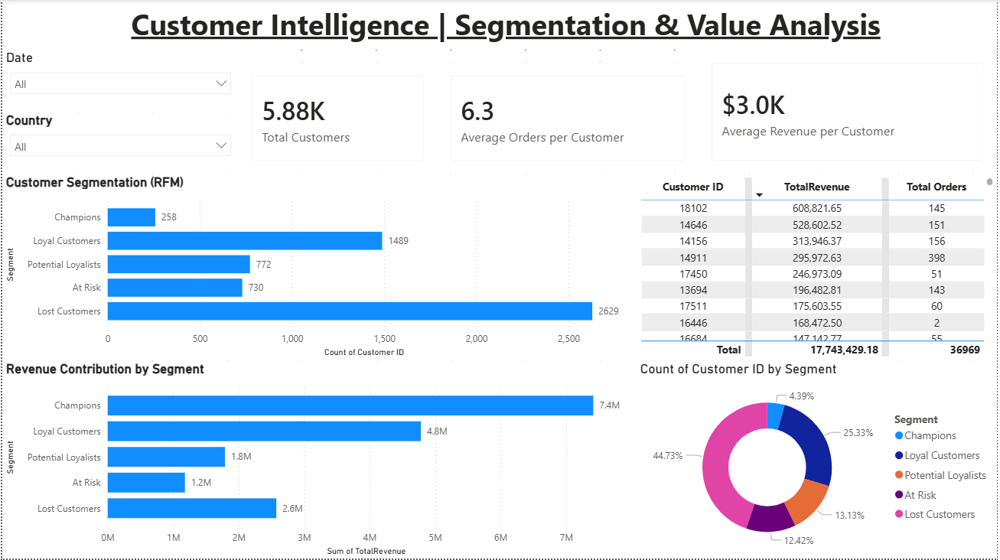
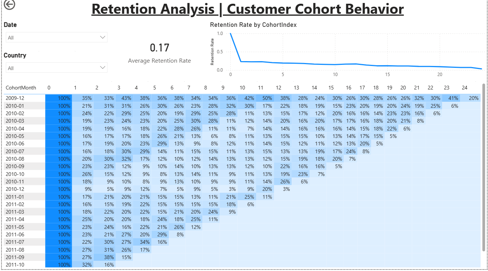

# 📊 E-commerce Customer & Revenue Analysis (Power BI)

## 📌 Project Overview

This project presents a comprehensive **E-commerce analytics dashboard** built using Power BI.
It focuses on understanding business performance, customer behavior, and retention patterns to support data-driven decision-making.

## 🎯 Objectives

* Analyze overall business performance (revenue, orders, customers)
* Identify high-value customers using segmentation techniques
* Evaluate customer retention and churn behavior
* Discover key product and revenue drivers

## 📊 Dashboard Pages

### 🥇 Executive Overview

* Total Revenue, Orders, Customers, and AOV
* Revenue trends over time
* Top countries and products

### 🥈 Customer Intelligence

* RFM Segmentation (Champions, Loyal, At Risk, etc.)
* Customer distribution across segments
* Revenue contribution by segment
* Top customers analysis

### 🥉 Retention Analysis

* Cohort analysis to track customer retention over time
* Retention heatmap (monthly cohorts)
* Retention trend visualization
* Interactive tooltips showing customer count & revenue

### 🏁 Product & Revenue Insights

* Top-performing products
* Revenue vs Quantity analysis by product category
* Identification of high-volume vs high-value products

## 🧠 Key Insights

* A small percentage of customers (Champions) generate a significant portion of total revenue
* Customer retention drops significantly after the first month
* Certain products generate high sales volume but relatively lower revenue
* Revenue is concentrated within a limited number of products and regions

## 📂 Dataset

Due to file size limitations, the raw dataset is not included in this repository.

You can access and download the dataset from here:
👉 **[https://www.kaggle.com/datasets/mashlyn/online-retail-ii-uci]**

## 🛠️ Tools & Techniques

* **Power BI**
* Data Cleaning & Transformation (Power Query)
* Data Modeling (Star Schema)
* DAX Measures & Calculations
* RFM Segmentation
* Cohort Analysis
* Interactive Dashboard Design

## 📷 Dashboard Preview

*(## 📷 Dashboard Preview

### 🥇 Executive Overview

---

### 🥈 Customer Intelligence

---

### 🥉 Retention Analysis

---

### 🏁 Product & Revenue Insights

)*

## 🚀 How to Use

1. Download the `.pbix` file from this repository
2. Download the dataset from the link above
3. Open Power BI Desktop
4. Update the data source if needed
5. Explore the dashboard using filters and visuals

## 📬 Contact

If you have any feedback or opportunities, feel free to connect with me on LinkedIn.
at www.linkedin.com/in/yasser-ramzy-154168261

---
